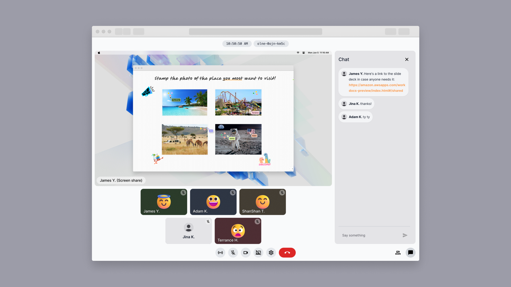
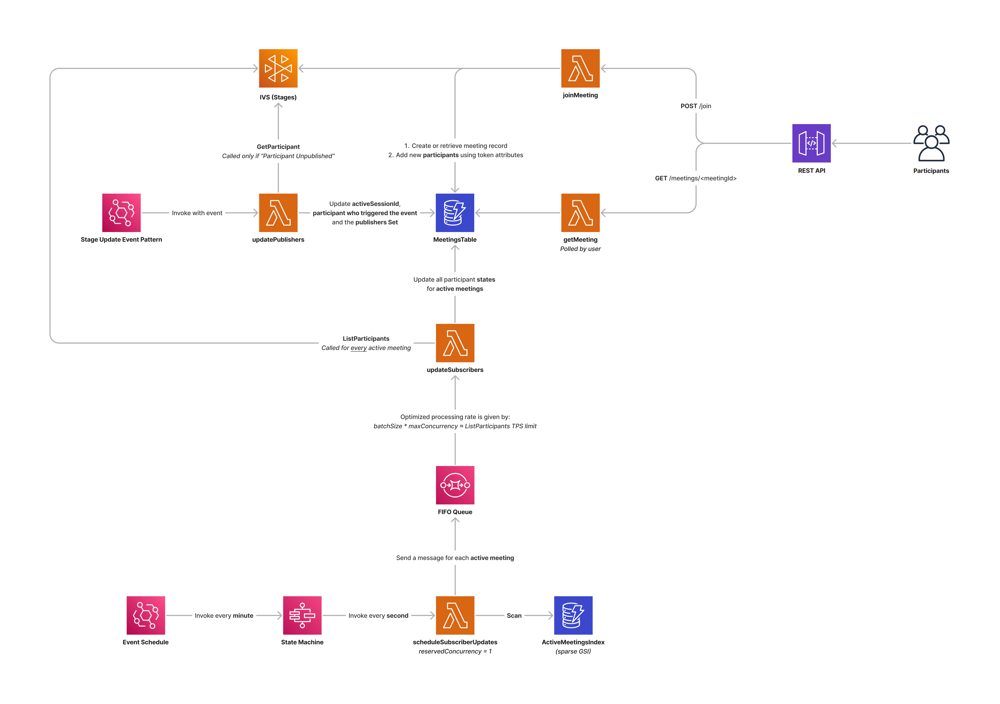

# Amazon IVS Real-time Collaboration Web Demo

A demo web application intended as an educational tool to demonstrate how you can build a compelling video collaboration experience powered by [Amazon IVS Real-time](https://docs.aws.amazon.com/ivs/latest/RealTimeUserGuide/what-is.html).

This demo uses [AWS Cloud Development Kit](https://aws.amazon.com/cdk/) (AWS CDK v2).



**This project is intended for educational purposes only and not for production usage.**

## 🔗 Quick links

- [Deploying the application to AWS](#deploying-the-application-to-aws)
  - [Prerequisites](#prerequisites)
  - [Configuration](#configuration)
  - [Initialization](#initialization)
  - [Deploy the backend](#deploy-the-backend)
  - [Deploy the website](#deploy-the-website)
- [Running the application locally](#running-the-application-locally)
- [Managing the key-pair for participant stage tokens](#managing-the-key-pair-for-participant-stage-tokens)
- [Subscribe-only participants architecture (experimental)](#subscribe-only-participants-architecture-experimental)
- [Teardown and clean-up](#teardown-and-clean-up)
- [About Amazon IVS](#about-amazon-ivs)
- [Security](#security)
- [License](#license)

## Deploying the application to AWS

_IMPORTANT NOTE: Deploying this demo application in your AWS account will create and consume AWS resources, which will cost money._

### Prerequisites

Before continuing, ensure you have installed the following tools:

- [AWS CLI Version 2](https://docs.aws.amazon.com/cli/latest/userguide/install-cliv2.html)
- [NodeJS](https://nodejs.org/en/) v20 and `npm` (npm is usually installed with NodeJS)
  - If you have [node version manager](https://github.com/nvm-sh/nvm) installed, run `nvm use` to sync your node version with this project

For configuration specifics, refer to the [AWS CLI User Guide](https://docs.aws.amazon.com/cli/latest/userguide/cli-chap-configure.html).

### Configuration

Prior to deploying the backend and website CloudFormation stacks to an AWS account, there are a few configurable settings that you have the option of customizing. These settings allow you to tailor the deployment to your specific needs, such as using custom domains, managing SSL certificates, and controlling user sign-up permissions.

The configuration options are defined in the following TypeScript interface:

```typescript
interface Config {
  readonly domain?: string;
  readonly subdomain?: string;
  readonly certificateAlternativeDomains?: string[] | null;
  readonly sslCertificateARN?: string | null;
  readonly allowedSignUpDomains?: string[] | null;
}
```

The following table outlines these configurable options in detail:

| **Option**                      | **Type**           | **Required** | **Description**                                                                                            | **Example**                                                                           |
| ------------------------------- | ------------------ | ------------ | ---------------------------------------------------------------------------------------------------------- | ------------------------------------------------------------------------------------- |
| `domain`                        | `string`           | Yes\*        | Specifies the custom domain name for the frontend application deployment.                                  | "example.com"                                                                         |
| `subdomain`                     | `string`           | No           | Specifies the custom subdomain name for the frontend application deployment.                               | "staging"                                                                             |
| `certificateAlternativeDomains` | `string[] \| null` | No           | List of additional domains to register under the SSL certificate. Use asterisk (`*`) for wildcard domains. | ["*.example.com", "other.example.com"]                                                |
| `sslCertificateARN`             | `string \| null`   | No           | ARN of an existing certificate in Amazon Certificate Manager (must be in `us-east-1` region).              | "arn:aws:acm:us-east-1:123456789012:certificate/1a2b3c4d-5e6f-7g8h-9i0j-1k2l3m4n5o6p" |
| `allowedSignUpDomains`          | `string[] \| null` | No           | List of email domains allowed for user account creation.                                                   | ["example.com", "company.com"]                                                        |

\* `domain` is **required** only for custom domain deployments.

1. If `sslCertificateARN` is provided, `certificateAlternativeDomains` will be ignored, and no new SSL certificate will be created during deployment
2. For `allowedSignUpDomains`:
   - An empty array (`[]`) blocks all user sign-ups
   - `null` or omitting the property allows all email domains for account creation
3. The SSL certificate created or specified must be in the `us-east-1` region for compatibility with CloudFront distributions
4. Using a wildcard domain (e.g., `*.example.com`) in `certificateAlternativeDomains` is recommended for multi-environment deployments under the same host domain to reuse the same certificate

The deployment settings for this application can be customized using the [`infra/cdk.json`](/infra/cdk.json) file. This file allows for both global settings that apply to all deployments and environment-specific settings that override global settings for particular environments.

The `cdk.json` file uses the following structure:

```javascript
{
  "global": {
    // Settings applied to all environments unless overridden
  },
  "test": {
    // Settings specific to the test environment
  },
  "staging": {
    // Settings specific to the staging environment
  },
  "production": {
    // Settings specific to the production environment
  },
  "development": {
    // Settings specific to the development environment
  }
}
```

Environment-specific settings take precedence over global settings. This allows for fine-grained control over each deployment environment while maintaining common settings across all environments.

Here's an expanded example of a deployment configuration:

```json
{
  "global": {
    "domain": "example.com",
    "certificateAlternativeDomains": ["*.example.com"],
    "sslCertificateARN": null,
    "allowedSignUpDomains": ["example.com", "other-example.com"]
  },
  "test": {
    "subdomain": "test",
    "allowedSignUpDomains": null
  },
  "staging": {
    "subdomain": "staging"
  },
  "production": {
    "sslCertificateARN": "arn:aws:acm:us-east-1:123456789:certificate/abc-123-xyz-def",
    "allowedSignUpDomains": ["example.com"]
  },
  "development": {
    "allowedSignUpDomains": []
  }
}
```

In this configuration:

1. All environments use `example.com` as the base domain
2. A wildcard SSL certificate is created for `*.example.com`, used by all environments except production
3. The production environment uses a custom SSL certificate
4. Subdomains are specified for test, staging, and development environments
5. Sign-up domains are restricted differently for each environment:
   - Global: allows sign-ups from `example.com` and `other-example.com`
   - Test: allows sign-ups from any domain (overrides global setting)
   - Staging: uses global settings (example.com and other-example.com)
   - Production: restricts sign-ups to only `example.com`
   - Development: blocks all sign-ups

This configuration demonstrates how to:

- Apply common settings across all environments
- Override specific settings for individual environments
- Use different subdomains for non-production environments
- Apply varying levels of sign-up restrictions per environment
- Use a custom SSL certificate for the production environment

Additional resource-level configuration options can be found in the [`infra/lambdas/constants.ts`](/infra/lambdas/constants.ts) file. These values only pertain to resources created by the Lambda functions, such as Stages and Chat Rooms.

### Initialization

Before deploying the backend and website CloudFormation stacks to your AWS account, you need to initialize the application for deployment. This process involves installing dependencies and creating a CDK bootstrap stack. Follow these steps:

1. **Install dependencies and bootstrap the main region:**

   ```bash
   npm run deploy:init
   ```

   This command installs the `infra` dependencies and creates a CDK bootstrap stack in your default AWS region if it doesn't already exist.

2. **Bootstrap the us-east-1 region (if needed):**

   If you plan to create an SSL certificate as part of the website deployment, you must ensure that the `us-east-1` region is also bootstrapped. This is because Amazon CloudFront requires SSL certificates to reside in the `us-east-1` region.

   To bootstrap the `us-east-1` region, run:

   ```bash
   AWS_REGION=us-east-1 npm run deploy:bootstrap
   ```

   Note: If your default region is already `us-east-1`, you can skip this step.

**Additional notes**

- These initialization steps only need to be completed once per AWS account
- If you're deploying to multiple regions, make sure to bootstrap each region you'll be using
- The `us-east-1` bootstrap is specifically required for SSL certificate handling with CloudFront, regardless of your primary deployment region
- If you encounter any permission-related errors during bootstrapping, ensure that your AWS credentials have the necessary permissions to create resources in the respective regions

After completing these initialization steps, your AWS environment will be prepared for deploying the application stacks. You can proceed with the actual deployment process as outlined in the subsequent sections of this README.

### Deploy the backend

After completing all deployment prerequisites, you're ready to deploy the backend stack. This step is crucial whether you plan to run the application locally or deploy it through the website stack. The backend stack creates several essential resources in your AWS account:

- API Gateway REST API (`MeetingsAPI`)
- AppSync GraphQL API (`MessagesAPI`)
- DynamoDB Table (for meeting data storage)
- Lambda functions
- Cognito user pool
- SQS FIFO queue
- KMS symmetric key
- SSM parameter (for public key ARN storage)
- Secrets Manager secret value (for private key storage)
- AWS Step Functions State Machine
- Multiple EventBridge Rules (scheduled and event-driven)

To deploy the backend stack, use the command corresponding to your desired application environment:

| **Environment** | **Command**                      |
| --------------- | -------------------------------- |
| development     | `npm run deploy:backend:dev`     |
| test            | `npm run deploy:backend:test`    |
| staging         | `npm run deploy:backend:staging` |
| production      | `npm run deploy:backend:prod`    |

**Additional notes**

- For local application development, deploy to the `development` environment
- The stack outputs, including API endpoints and other configuration details, are automatically retrieved when running the app locally. This is done using the CloudFormation SDK when starting the development server.
- No additional frontend configuration is required after deployment, as the necessary information is fetched dynamically

### Deploy the website

**Note**: if you only intend to run the application locally and do not plan to host it, you can skip this section and proceed directly to the [Running the Application Locally](#running-the-application-locally) section.

**Prerequisite**: you must have successfully deployed the backend stack before proceeding with the website deployment.

Once the backend stack is in place, you're ready to deploy the website stack. This stack creates a CloudFront distribution to serve a static Single Page Application (SPA) hosted on Amazon S3.

The website deployment process differs slightly depending on the target environment:

- For the `development` environment:
  - The application bundle is deployed to a CloudFront distribution
  - It's served from the public CloudFront distribution domain only
  - No custom domain is used
- For other environments (`test`, `staging`, `production`):
  - The deployment can utilize custom domains if configured
  - SSL certificates are managed as per the configuration settings

When deploying to a custom domain without providing an existing SSL certificate:

- A separate CloudFormation stack is created in the `us-east-1` region
- This stack provisions a DNS certificate in the `us-east-1` region, which is required for CloudFront distributions
- The newly created certificate is then imported back into the main website stack

**Note**: This additional stack creation only occurs if you've configured a custom domain in your deployment settings and haven't specified an existing `sslCertificateARN`.

To deploy the website stack, use the command corresponding to your desired application environment:

| **Environment** | **Command**                      |
| --------------- | -------------------------------- |
| development     | `npm run deploy:website:dev`     |
| test            | `npm run deploy:website:test`    |
| staging         | `npm run deploy:website:staging` |
| production      | `npm run deploy:website:prod`    |

**Additional notes**

- Ensure that you've properly configured any custom domains or SSL certificates as described in the [Configuration](#configuration) section before deploying to non-development environments
- The website deployment process automatically bundles and optimizes your frontend application prior to deployment
- After deployment, CDK will output the URL where your application is accessible. For custom domain deployments, it may take some time for DNS changes to propagate
- Remember that the website stack depends on the backend stack, so any major changes to the backend might require a redeployment of the website stack as well

## Running the Application Locally

Before running the application locally, ensure that you have completed the following prerequisite:

**Prerequisite**: [Deploy the backend stack](#deploy-the-backend) to the `development` environment.

Once you have the backend infrastructure in place, you can run the application on your local machine for development and testing purposes. This process will start a development server that connects to the deployed backend resources.

To run the application locally, run the following command:

```bash
npm start
```

This command does the following:

- Retrieves the necessary configuration from the CloudFormation stack outputs of the backend stack deployed to the `development` environment
- Sets up the development environment with the correct API endpoints, user pool details, and other required configurations
- Starts the development server, typically on `http://localhost:3000` (unless configured otherwise)

## Managing the key-pair for participant stage tokens

This demo application uses a public/private key-pair to create and verify participant stage tokens.

- The application generates an ECDSA public/private key pair
- The private key is used to sign JSON Web Tokens (JWTs) on the server
- The public key is imported to Amazon IVS for token verification during stage join
- For more details, see the [Amazon IVS documentation on distributing tokens](https://docs.aws.amazon.com/ivs/latest/RealTimeUserGuide/getting-started-distribute-tokens.html)

While the initial key-pair is created automatically when deploying the backend stack, you may need to rotate these keys periodically or immediately if you suspect the private key has been compromised.

To manually rotate the key-pair, run the following command:

```bash
npm run rotateKeyPair -- --appEnv {APP_ENV}
```

Replace `{APP_ENV}` with the environment of your deployed backend stack (e.g. `development`, `test`, `staging` or `production`).

When you run the key rotation command:

1. A new ECDSA public/private key pair is generated
2. The new public key is imported to IVS
3. The old public key is deleted from IVS
4. The new private key replaces the old one in AWS Secrets Manager
5. The new public key ARN is updated in AWS Systems Manager Parameter Store

## Teardown and clean-up

When you're finished with your deployment or want to remove all created resources, you should tear down the stacks to avoid unexpected charges to your AWS account. This process involves destroying both the backend and website stacks, followed by some manual clean-up steps.

### Destroying the Stacks

1. **Destroy the Website Stack**

   To tear down the website stack, use the following command:

   ```bash
   APP_ENV={APP_ENV} npm run destroy:website {STACK_NAME}
   ```

   Replace `{APP_ENV}` with the appropriate environment (e.g., `development`, `test`, `staging`, or `production`).

   Replace `{STACK_NAME}` with the name of your website stack.

   **For Custom Domain Deployments:**

   If you deployed with a custom domain, an additional certificate stack was created in the `us-east-1` region. To destroy both the website and certificate stacks, use:

   ```
   APP_ENV={APP_ENV} npm run destroy:website --all
   ```

   **Important:** Before running this command, you may need to disable termination protection on the certificate stack:

   1. Go to the AWS CloudFormation console in the `us-east-1` region
   2. Select the certificate stack
   3. Choose "Edit termination protection" from the "Stack actions" dropdown
   4. Disable termination protection

2. **Destroy the Backend Stack**

   After the website stack is destroyed, tear down the backend stack using this command:

   ```bash
   APP_ENV={APP_ENV} npm run destroy:backend
   ```

   Again, replace `{APP_ENV}` with the appropriate environment.

### Manual Clean-up Steps

After destroying the stacks, some resources may still remain and need manual cleanup. These resources don't incur charges when inactive but should be removed for completeness:

- **IVS Stages**
- **IVS Chat Rooms**
- **IVS Imported Public Keys**

To perform these clean-up steps:

1. Log in to the AWS Management Console
2. Navigate to the Amazon IVS service
3. Check for and delete any remaining Stages, Chat Rooms, and imported public keys associated with your application

## Subscribe-only participants architecture (experimental)

This demo implements a custom-built, experimental architecture that keeps track of subscribe-only participants for each Stage and displays this information in the application.

Below is a detailed view of the architecture that makes this experimental feature possible:



## About Amazon IVS

Amazon Interactive Video Service (Amazon IVS) is a managed live streaming and stream chat solution that is quick and easy to set up, and ideal for creating interactive video experiences. [Learn more](https://aws.amazon.com/ivs/).

- [Amazon IVS docs](https://docs.aws.amazon.com/ivs/)
- [User Guide](https://docs.aws.amazon.com/ivs/latest/userguide/)
- [API Reference](https://docs.aws.amazon.com/ivs/latest/APIReference/)
- [Setting Up for Streaming with Amazon Interactive Video Service](https://aws.amazon.com/blogs/media/setting-up-for-streaming-with-amazon-ivs/)
- [Learn more about Amazon IVS on IVS.rocks](https://ivs.rocks/)
- [View more demos like this](https://ivs.rocks/examples)

## Security

See [CONTRIBUTING](CONTRIBUTING.md#security-issue-notifications) for more information.

## License

This library is licensed under the MIT-0 License. See the [LICENSE](LICENSE) file.
